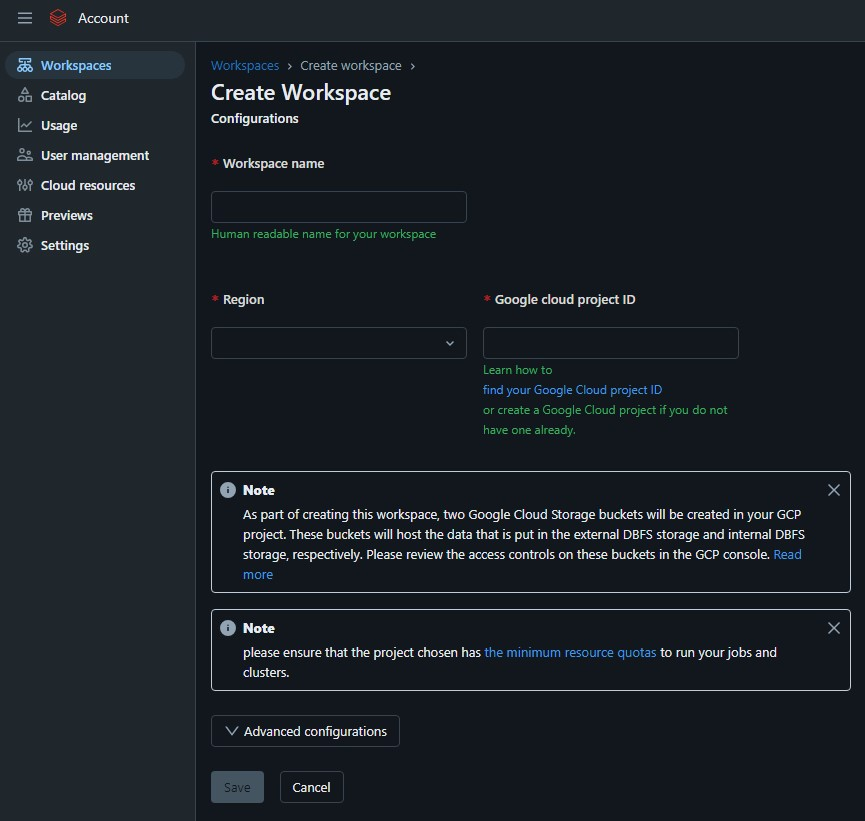
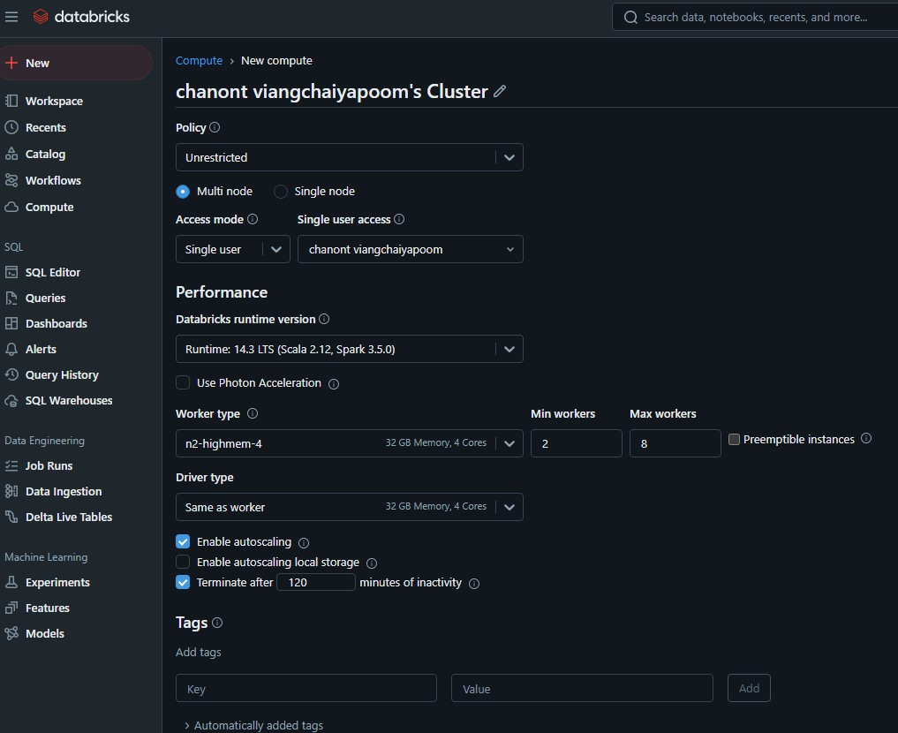
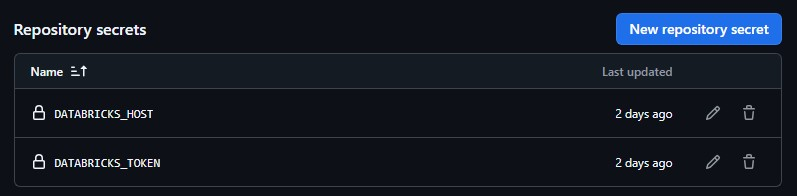
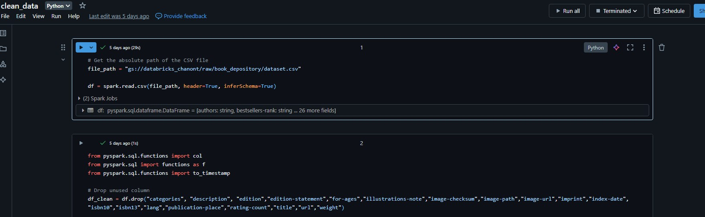
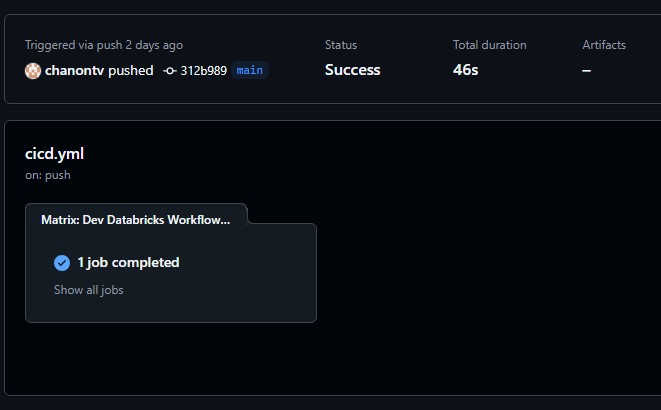
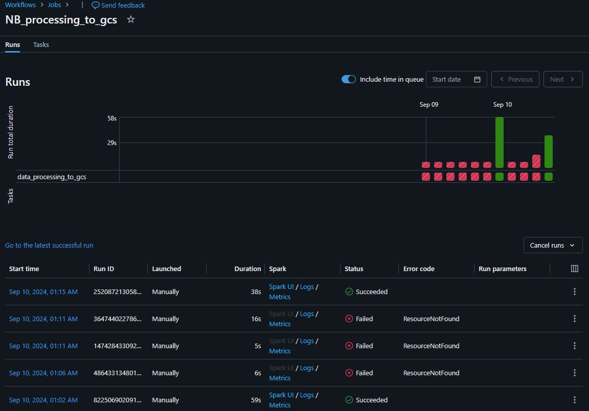
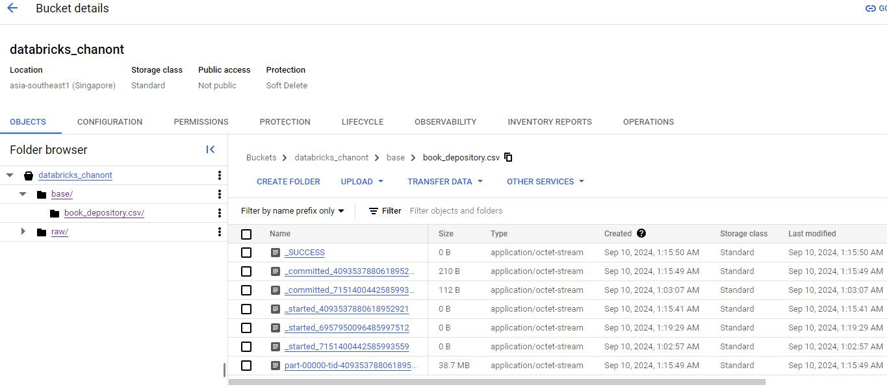

# databricks_workflow

## Workflow
   - Set up and configured the Databricks workspace and compute resources.
   
   
   - Generate a new token on Databricks and add it to the GitHub repository secrets.
   
   - Retrieved datasets from Kaggle and performed data cleaning using PySpark.
   
   - Designed and implemented a CI/CD pipeline for deployment processes.
   
   - Automated job scheduling and execution within Databricks. 
   
   - Uploaded processed results to Google Cloud Storage (GCS).
   

## Dataset
https://www.kaggle.com/datasets/sp1thas/book-depository-dataset